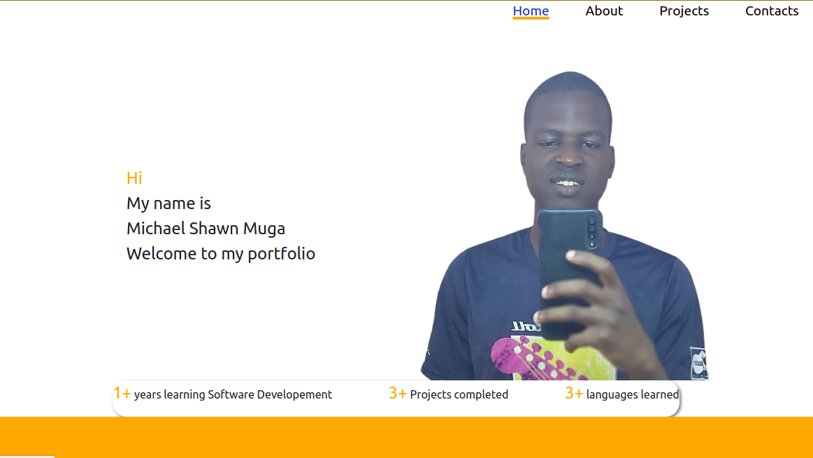
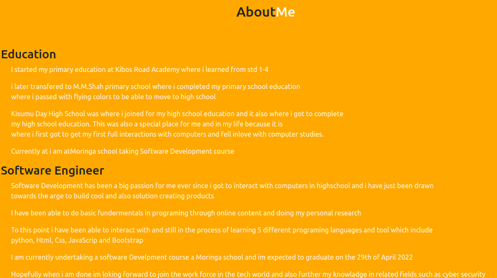
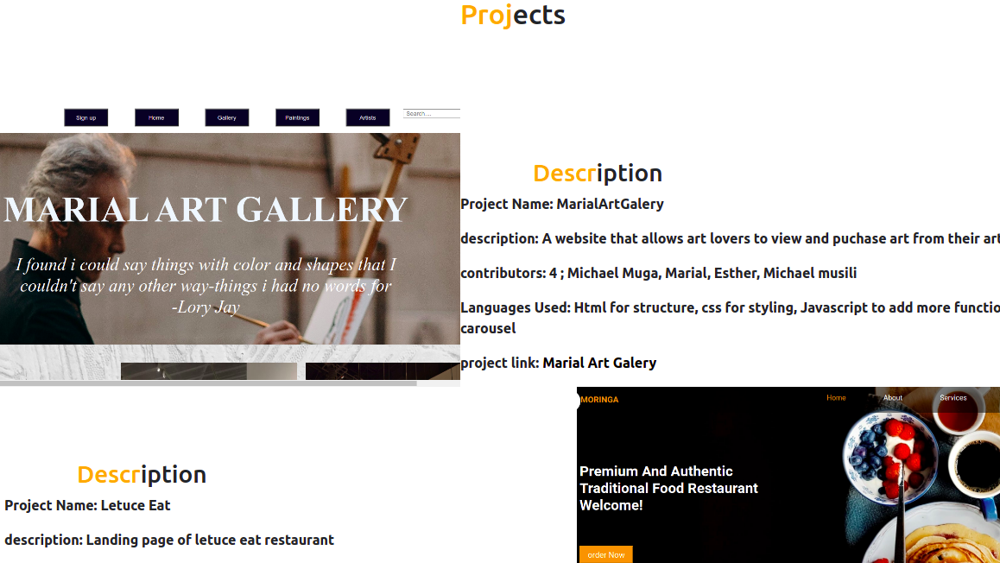
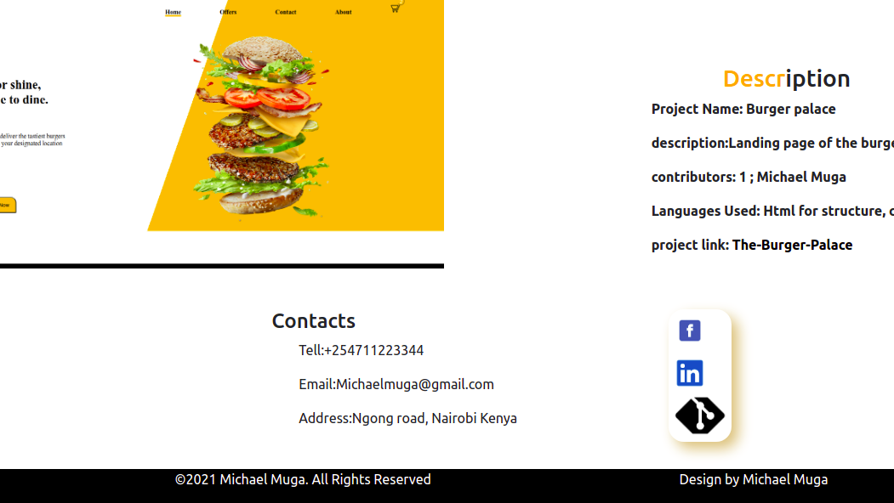

# Portfolio
by Michael Muga

# Table of content

+ [Description](#description)
+ [Installation ](#Installation)
+ [Technology Used](#technology-used)
+ [License](#License)
+ [Authors Info](#author-Info)

## Description
This is the landing page of my portfolio website
## Installation
To install or access this website you need:

* Either a computer,phone,tablet or an Ipad 
* connected to internet

### Installation Process

Click on the link provided bellow to view the site.
https://michael-muga.github.io/Letuce_Eat/

## Technology Used
Html- used to structure this website
Css- used to style the website
Boostrap- used to style the website
## License
MIT license
cpyright (c) [2021][Michael Muga]

Permission is hereby granted, free of charge, to any person obtaining a copy
of this software and associated documentation files (the "Software"), to deal
in the Software without restriction, including without limitation the rights
to use, copy, modify, merge, publish, distribute, sublicense, and/or sell
copies of the Software, and to permit persons to whom the Software is
furnished to do so, subject to the following conditions:

The above copyright notice and this permission notice shall be included in all
copies or substantial portions of the Software.

THE SOFTWARE IS PROVIDED "AS IS", WITHOUT WARRANTY OF ANY KIND, EXPRESS OR
IMPLIED, INCLUDING BUT NOT LIMITED TO THE WARRANTIES OF MERCHANTABILITY,
FITNESS FOR A PARTICULAR PURPOSE AND NONINFRINGEMENT. IN NO EVENT SHALL THE
AUTHORS OR COPYRIGHT HOLDERS BE LIABLE FOR ANY CLAIM, DAMAGES OR OTHER
LIABILITY, WHETHER IN AN ACTION OF CONTRACT, TORT OR OTHERWISE, ARISING FROM,
OUT OF OR IN CONNECTION WITH THE SOFTWARE OR THE USE OR OTHER DEALINGS IN THE
SOFTWARE.

## Authors Info
slack profile- [Michael Muga]
